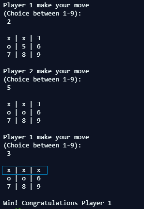

# Tic Tac Toe
> A classic mini game to play by command line.



<br>The focus here is to use oriented programming concepts.<br>
The lesson can be see in [Odin Project](https://www.theodinproject.com/courses/ruby-programming/lessons/oop)

## Content

* [Requirements](#requirements)
* [Built With](#built-with)
* [Live Demo](#live-demo)
* [Quick Start](#quick-start)
* [Dependencies](#dependencies)
* [Contributing](#contributing)
* [Acknowledgments](#acknowledgments)
* [Author](#author)
* [License](#license)


## Requirements

<ul>
  <h3>Features</h3>
  <li>Get user input</li>
  <li>Display a board</li>
  <li>Stop if someone win</li>
</ul>

### Built With

- Ruby Language <br>
- Rubocop (Linter) with Stickler (CI Tool)<br>
- Rspec (Unit testing) <br>
- Git (with Gitflow), Github and VScode <br>

## Live Demo

[Run on Repl.it](https://repl.it/@ThiagoMiranda2/tictactoeruby)

## Quick Start

To get a local copy use:<br>
```js
git clone git@github.com:SevlaMare/TicTacToe_Ruby.git
```

### Dependencies

Ruby 2.5.5

### Contributing

Contributions, issues and feature requests are welcome!

You can do it on [issues page](issues/).

## Acknowledgments

A special thanks for the code reviewers.

## Author

👤 **Thiago Miranda**

- Github: [@SevlaMare](https://github.com/SevlaMare)
- Twitter: [#SevlaMare)](https://twitter.com/SevlaMare)
- Linkedin: [SevlaMare)](https://www.linkedin.com/in/sevlamare)

### License

<strong>Creative Commons</strong>